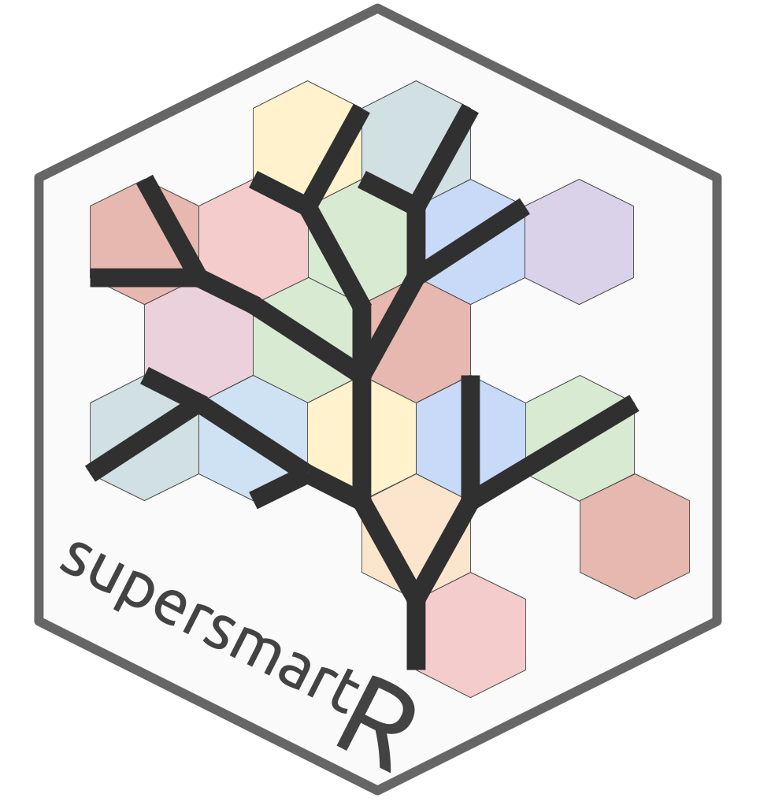

# supersmartR 

[SUPERSMART](http://www.supersmart-project.org/) is a program for the automated generation of phylogenetic trees based around a hybrid method using both the supermatrix and supertree approach. `supersmartR` is a project aimed at providing SUPERSMART functionality in the R environment.

The main goals of `supersmartR` are to provide independent R packages that can be strung together to recreate the SUPERSMART pipeline. The advantages of having indepdendent modules are:
* Easier maintainance
* Eaiser development
* More transparent code
* Greater level of scrutiny and review
* Greater usage
* Less code duplication

## 

## Available modules

> *How do these modules interact?* Check out the [supersmartR-workshop](https://github.com/AntonelliLab/supersmartR-workshop/) page to learn how these modules can be used to construct reproducible workflows for constructing phylogenetic trees all from within R.

### `phylotaR` 

The `phylotaR` package provides a pipeline that uses an alignment search tool to identify orthologous sequences without the need for gene name matching. For a given parental taxonomic group, the pipeline will search through available sequences hosted on GenBank and identify orthologous sequence clusters. A user is then able to survey the identified clusters and select the ones which best suit their phylogenetic analysis needs, e.g. by selecting the clusters that maximise the number of taxonomic groups.

[**View on GitHub**](https://github.com/ropensci/phylotaR)

### `restez` 

This package aims to make sequence retrieval more efficient by allowing a user to download large sections of the GenBank database to their local machine and query this local database either through package specific functions or Entrez wrappers. This process is more efficient as GenBank downloads are made via NCBI's FTP using compressed sequence files. With a good internet connection and a middle-of-the-road computer, a database comprising 20 GB of sequence information can be generated in less than 10 minutes.

[**View on GitHub**](https://github.com/ropensci/restez)

### `outsider` 

Integrating external programs into a deployable, R workflow can be challenging. Although there are many useful functions and packages (e.g. system() or reticulate) for calling code and software from alternative languages, these approaches require users to independently install dependant software and may not work across platforms. `outsider` aims to make this easier by allowing users to install, run and control programs outside of R across all operating systems.

[**View on GitHub**](https://github.com/antonellilab/outsider)

### `gaius` 

Phylogeny building for large clades using a divide and conquer supermatrix-supertree approach.

[**View on GitHub**](https://github.com/antonellilab/gaius)

## Citations

Antonelli A., Hettling H., Condamine F.L., Vos, K. Nilsson R.H., Sanderson, M.J., Sauquet, H., Scharn, R., Silvestro, D., Töpel, M., Bacon, C.D., Oxelman, B. Vos, R.A. 2016. Toward a Self-Updating Platform for Estimating Rates of Speciation and Migration, Ages, and Relationships of Taxa Systematic Biology first published online September 10, 2016 [doi:10.1093/sysbio/syw066] 

Bennett et al. (2018). restez: Create and Query a Local Copy of GenBank in R. Journal of Open Source Software, 3(31), 1102. https://doi.org/10.21105/joss.01102

Bennett, D., Hettling, H., Silvestro, D., Zizka, A., Bacon, C., Faurby, S., … Antonelli, A. (2018). phylotaR: An Automated Pipeline for Retrieving Orthologous DNA Sequences from GenBank in R. Life, 8(2), 20. DOI:10.3390/life8020020

Bennett et al. (2019). outsider: Install and run programs, outside of R, inside of R. Journal of Open Source Software, *In review*.

